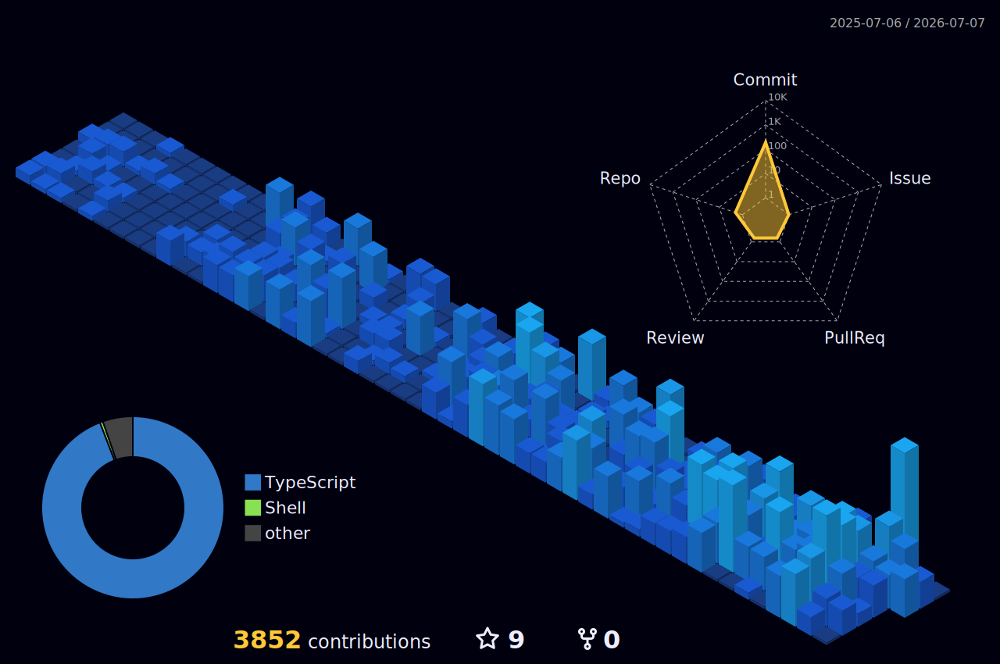

<!-- HEADER -->

<!-- TYPING -->

  

Full-stack developer focused on building impactful, user-friendly products where functionality meets clean design. I ship end to end — from database schema to pixel-perfect UI — and I'm always pushing the boundaries of what I can build.

- Currently working with **TypeScript, Next.js, Convex & Docker**
- Exploring self-hosted infrastructure, monitoring stacks & AI-assisted apps
- Ask me about full-stack TypeScript, React, or shipping side projects
- Fun fact: I like turning messy bank statements into clean spending insights

<h2 align="center">Connect with me</h2>

## Tech Stack

**Languages**

**Frameworks & Libraries**

**Infrastructure & DevOps**

**Tools & Services**

## Featured Projects

| Project | Description | Tech |
| ------- | ----------- | ---- |
| [**Play-Radar**](https://github.com/Well0-1/Play-Radar) | Open-source platform that compares game system requirements and tells users whether their PC can run a game. | JavaScript |
| [**Kizuna**](https://github.com/meduware/Kizuna) | Self-hosted, secure messaging platform for communities — microservice architecture with an API Gateway and Supabase Realtime. | Next.js · Node.js · Supabase |
| [**Ekstre**](https://github.com/meduware/ekstre) | Mobile-first bank-statement spending analysis — AI extracts & categorizes transactions, ships to iOS/Android via Capacitor. | Next.js · Convex |
| [**Portfolio**](https://github.com/Well0-1/akyuzoglu-dev) | My personal portfolio → [akyuzoglu-dev.vercel.app](https://akyuzoglu-dev.vercel.app) | Next.js |

<h2 align="center">GitHub Stats</h2>

  
  

## 3D Contribution Calendar

